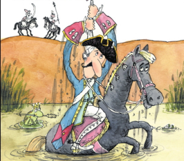

```{r setup, include=FALSE}
knitr::opts_chunk$set(echo = FALSE, warning = FALSE, message = FALSE, dev='cairo_pdf')
options(tinytex.verbose = TRUE)
library(tidyverse)
library(extrafont)
theme_set(theme_bw()+theme(text = element_text(size = 20, family = "Brill")))

# create qrcode
# library(qrcode)
# png(filename="images/00_qrcode.png", width = 200, height = 200)
# qrcode_gen("https://github.com/agricolamz/2022.04.05_HSE_NN_variation/raw/master/2022.04.05_HSE_NN_variation.pdf")
# dev.off()

# read zilo data
zilo_experiment <- read_csv("data/zilo_experiment_questionary.csv")

# mask and prepare raw data from the survey
nd_fes <- read_csv("data/nakh-daghestanian_fieldwork_elicitation_survey.csv")
if("Sygnatura czasowa" %in% colnames(nd_fes)){
  nd_fes %>% 
    mutate(id = 1:n()) %>% 
    pivot_longer(names_to = "question", values_to = "answer", 3:50) %>% 
    select(-1) %>% 
    filter(!is.na(answer)) %>% 
    rename(lang = colnames(nd_fes)[2]) %>% 
    mutate(lang = ifelse(lang == "на русском", "ru", "en"),
           q_id = str_extract(question, "\\d{1,}")) %>% 
    filter(q_id != 0, q_id != 1) %>% 
    mutate(q_name = case_when(
      q_id == 2 ~ "education_lvl",
      q_id == 3 ~ "interest",
      q_id == 4 ~ "linguistics_university",
      q_id == 5 ~ "student_fieldwork",
      q_id == 6 ~ "finish_study",
      q_id == 7 ~ "place_of_study",
      q_id == 8 ~ "place_of_work",
      q_id == 9 ~ "n_people_fieldwork_actual",
      q_id == 10 ~ "n_people_fieldwork_preference",
      q_id == 11 ~ "goals_fieldwork",
      q_id == 12 ~ "main_goal_fieldwork",
      q_id == 13 ~ "elicitation",
      q_id == 14 ~ "corpora",
      q_id == 15 ~ "n_speakers_preference",
      q_id == 16 ~ "n_speakers_actual",
      q_id == 17 ~ "contradicted_answers",
      q_id == 18 ~ "selfcontradicted_answers",
      q_id == 19 ~ "younger_13",
      q_id == 20 ~ "older_70",
      q_id == 21 ~ "prefer_work",
      q_id == 22 ~ "prefer_not_to_work"
      )) %>% 
    pivot_wider(names_from = q_name, values_from = answer, -c("question", "q_id")) %>% 
    mutate(education_lvl = case_when(
      education_lvl == "доктором наук" ~ "Professor",
      education_lvl == "кандидатом наук" ~ "PhD",
      str_detect(education_lvl, "студентом") ~ "Graduate student",
      TRUE ~ education_lvl),
      interest_phonology = str_detect(interest, "фонол|phonetics"),
      interest_morphology = str_detect(interest, "морфология|Morphology"),
      interest_syntax = str_detect(interest, "синтаксис|Syntax"),
      interest_lexicon = str_detect(interest, "лексика|Lexicon"),
      interest_discourse = str_detect(interest, "дискурс|discourse"),
      interest_sociolinguistics = str_detect(interest, "социолингвистика|Sociolinguistics"),
      interest_typology = str_detect(interest, "типология|typology"),
      interest_documentation = str_detect(interest, "документирование|documentation"),
      interest_dialectology = str_detect(interest, "диалектология|Dialectology"),
      interest_historical = str_detect(interest, "сравнительно|Historical"),
      interest_computer = str_detect(interest, "компьютерная|computer"),
      interest_psycholinguistics = str_detect(interest, "психолингвистика|Psycholinguistics"),
      linguistics_university = !str_detect(linguistics_university, "No|нет"),
      student_fieldwork = !str_detect(student_fieldwork, "No|нет"),
      finish_study = str_replace(finish_study, "philosophy, logics, linguistics", "2011"),
      finish_study = str_replace(finish_study, "не закончил\\(а\\)", "2020"),
      finish_study = as.integer(str_extract(finish_study, "\\d{1,}")),
      study_moscow = str_detect(place_of_study, "Moscow|Москве"),
      study_europe = str_detect(place_of_study, "Europe|Европе"),
      study_us = str_detect(place_of_study, "the US"),
      place_of_work = str_replace(place_of_work, "не работал\\(а\\)", "I've never worked as a teacher or researcher."),
      place_of_work = str_replace(place_of_work, "в Европе", "in Europe"),
      place_of_work = str_replace(place_of_work, "в Москве", "in Moscow"),
      one_fildwork = str_detect(n_people_fieldwork_actual, "One|один"),
      small_group_fildwork = str_detect(n_people_fieldwork_actual, "small|маленькая"),
      large_group_fildwork = str_detect(n_people_fieldwork_actual, "large|большая"),
      n_people_fieldwork_preference = str_replace(n_people_fieldwork_preference, "где один/одна исследователь", "I prefer to work alone"),
      n_people_fieldwork_preference = str_replace(n_people_fieldwork_preference, "в маленькой группе \\(2-5 человек\\)", "with a small group (2-5 people)"),
      n_people_fieldwork_preference = str_replace(n_people_fieldwork_preference, "в большой группе", "with a large group"),
      educational_goal = str_detect(goals_fieldwork, "[Ee]ducational|учебные"),
      documentation_goal = str_detect(goals_fieldwork, "documentation|документация"),
      application_goal = str_detect(goals_fieldwork, "Application|применение"),
      research_goal = str_detect(goals_fieldwork, "Research|исследование"),
      main_goal_fieldwork = str_replace_all(main_goal_fieldwork, "документация языка", "Language documentation"),
      main_goal_fieldwork = str_replace_all(main_goal_fieldwork, "исследование грамматической темы \\(в широком смысле\\)", "Research on some theoretical problem (in the broadest possible sense)"),
      main_goal_fieldwork = str_replace(main_goal_fieldwork, "Не готов противопоставлять", "no answer"),
      elicitation = str_replace(elicitation, "Да", "Yes"),
      corpora = !str_detect(corpora, "No|Нет"),
      n_speakers_preference = ifelse(str_detect(n_speakers_preference, "As many as possible, in an ideal world"), "4-5", n_speakers_preference),
      n_speakers_preference = ifelse(str_detect(n_speakers_preference, "It is hard to answer"), "4-5", n_speakers_preference),
      n_speakers_preference = ifelse(str_detect(n_speakers_preference, "В зависимости от того, какова ожидаемая вариативность"), "2-5", n_speakers_preference),
      n_speakers_preference = ifelse(str_detect(n_speakers_preference, "Для разных тем разное"), NA, n_speakers_preference),
      n_speakers_preference = ifelse(str_detect(n_speakers_preference, "по-разному для разных проблем"), NA, n_speakers_preference),
      n_speakers_preference = ifelse(str_detect(n_speakers_preference, "Depends on the topic"), NA, n_speakers_preference),
      n_speakers_preference = str_replace(n_speakers_preference, "больше", ">"),
      n_speakers_preference = str_remove(n_speakers_preference, "> "),
      minimum_n_speakers_preference = str_remove(n_speakers_preference, "-\\d"),
      minimum_n_speakers_preference = as.integer(minimum_n_speakers_preference),
      maximum_n_speakers_preference = str_remove(n_speakers_preference, "\\d-"),
      maximum_n_speakers_preference = as.integer(maximum_n_speakers_preference),
      n_speakers_actual = str_replace(n_speakers_actual, "От 2-3 до 6-7", "2-7"),
      n_speakers_actual = str_replace(n_speakers_actual, "См. ответ на вопрос 15\\.", "2-7"),
      n_speakers_actual = str_replace(n_speakers_actual, "больше", ">"),
      n_speakers_actual = ifelse(str_detect(n_speakers_actual, "As many as possible"), 5, n_speakers_actual),
      n_speakers_actual = ifelse(str_detect(n_speakers_actual, "по-разному в зависимости от темы"), NA, n_speakers_actual),
      n_speakers_actual = ifelse(str_detect(n_speakers_actual, "I investigate through elicitation"), "4-5", n_speakers_actual),
      n_speakers_actual = str_remove(n_speakers_actual, "> "),
      minimum_n_speakers_actual = str_remove(n_speakers_actual, "-\\d"),
      minimum_n_speakers_actual = as.integer(minimum_n_speakers_actual),
      maximum_n_speakers_actual = str_remove(n_speakers_actual, "\\d-"),
      maximum_n_speakers_actual = as.integer(maximum_n_speakers_actual)
      ) %>% 
    select(-interest, -place_of_study, -n_people_fieldwork_actual, -goals_fieldwork, -n_speakers_actual, n_speakers_preference) %>% 
    write_csv("data/nakh-daghestanian_fieldwork_elicitation_survey.csv", na = "")
}
nd_fes <- read_csv("data/nakh-daghestanian_fieldwork_elicitation_survey.csv")

n_iter <- 100000
if(!file.exists("data/n_speakers_bootstraped.csv")){
library(bootstrap)
set.seed(42)
minimum_n_speakers_preference <- bootstrap(nd_fes$minimum_n_speakers_preference, nboot = n_iter, theta = function(x){mean(x, na.rm = TRUE)})
maximum_n_speakers_preference <- bootstrap(nd_fes$maximum_n_speakers_preference, nboot = n_iter, theta = function(x){mean(x, na.rm = TRUE)})
minimum_n_speakers_actual <- bootstrap(nd_fes$minimum_n_speakers_actual, nboot = n_iter, theta = function(x){mean(x, na.rm = TRUE)})
maximum_n_speakers_actual <- bootstrap(nd_fes$maximum_n_speakers_actual, nboot = n_iter, theta = function(x){mean(x, na.rm = TRUE)})

tibble(id = 1:100000,
       value = minimum_n_speakers_preference$thetastar,
       type = "preference",
       range = "minimum") %>% 
  bind_rows(tibble(id = 1:100000,
                   value = maximum_n_speakers_preference$thetastar,
                   type = "preference",
                   range = "maximum")) %>%
  bind_rows(tibble(id = 1:100000,
                   value = minimum_n_speakers_actual$thetastar,
                   type = "actual",
                   range = "minimum")) %>% 
  bind_rows(tibble(id = 1:100000,
                   value = maximum_n_speakers_actual$thetastar,
                   type = "actual",
                   range = "maximum")) %>% 
  write_csv("data/n_speakers_bootstraped.csv", na = "")
}
n_speakers_bootstraped <- read_csv("data/n_speakers_bootstraped.csv")

if(!file.exists("data/experiment_sampling.csv")){
zilo_experiment %>% 
  group_by(f_id, translation_ru) %>% 
  distinct(answer) %>% 
  count(f_id, translation_ru) ->
  experiment_types

set.seed(42)
n_speakers_bootstraped %>% 
  group_by(type, range) %>% 
  select(value) %>% 
  sample_n(100000, replace = TRUE) %>% 
  ungroup() %>% 
  rowwise() %>% 
  mutate(value_r = round(value),
         n_types_q1 = length(unique(sample(zilo_experiment[zilo_experiment$f_id == 1,]$value, value_r))),
         n_types_q2 = length(unique(sample(zilo_experiment[zilo_experiment$f_id == 2,]$value, value_r))),
         n_types_q3 = length(unique(sample(zilo_experiment[zilo_experiment$f_id == 3,]$value, value_r))),
         n_types_q4 = length(unique(sample(zilo_experiment[zilo_experiment$f_id == 4,]$value, value_r))),
         n_types_q5 = length(unique(sample(zilo_experiment[zilo_experiment$f_id == 5,]$value, value_r))),
         n_types_q6 = length(unique(sample(zilo_experiment[zilo_experiment$f_id == 6,]$value, value_r))),
         n_types_q7 = length(unique(sample(zilo_experiment[zilo_experiment$f_id == 7,]$value, value_r))),
         n_types_q8 = length(unique(sample(zilo_experiment[zilo_experiment$f_id == 8,]$value, value_r))),
         n_types_q9 = length(unique(sample(zilo_experiment[zilo_experiment$f_id == 9,]$value, value_r))),
         n_types_q10 = length(unique(sample(zilo_experiment[zilo_experiment$f_id == 10,]$value, value_r))),
         n_types_q11 = length(unique(sample(zilo_experiment[zilo_experiment$f_id == 11,]$value, value_r))),
         n_types_q12 = length(unique(sample(zilo_experiment[zilo_experiment$f_id == 12,]$value, value_r))),
         n_types_q13 = length(unique(sample(zilo_experiment[zilo_experiment$f_id == 13,]$value, value_r))),
         n_types_q14 = length(unique(sample(zilo_experiment[zilo_experiment$f_id == 14,]$value, value_r))),
         n_types_q15 = length(unique(sample(zilo_experiment[zilo_experiment$f_id == 15,]$value, value_r))),
         n_types_q16 = length(unique(sample(zilo_experiment[zilo_experiment$f_id == 16,]$value, value_r)))) %>% 
  pivot_longer(names_to = "q_id", values_to = "n_types", n_types_q1:n_types_q16)  %>% 
  mutate(f_id = as.integer(str_extract(q_id, "\\d{1,}"))) %>% 
  left_join(experiment_types) %>% 
  mutate(type_range = paste(type, range)) %>% 
  count(type_range, f_id, translation_ru, n_types) %>% 
  group_by(type_range, f_id, translation_ru) %>% 
  mutate(percentage = n/sum(n)*100) %>% 
  write_csv("data/experiment_sampling.csv", na = "")
}
experiment_sampling <- read_csv("data/experiment_sampling.csv")
```

# Исследование вариативности в зиловском диалекте андийского языка

## Вариативность

>- "Two equally interesting questions are at the heart of this book: how an extraordinary degree of idiosyncratic linguistic variation can coexist with an extraordinarily homogeneous speaker population, and how linguists might overlook the possibility of their coexistence." [@dorian10: 3]

>- Я сейчас представлю результаты анализа вариативность в моноэтничном селении Зило (андийский язык), а также покажу, как мы пробовали оценить, как "среднестатистический" исследователь получил бы похожие результаты.

## Данные

Данные были собраны у:

>- `r length(unique(zilo_experiment$speaker_id))` носителей андийского языка (нахско-дагестанская семья) во время полевого исследования (Ботлихский район, Дагестан) в 2019 году


>- и `r nrow(nd_fes)` исследователей нахско-дагестанских языков при помощи онлайн опроса.

# Зиловские данные

## `r length(unique(zilo_experiment$speaker_id))` носителей зиловского перевели следующие предложения:

(@butterfly_sg) 'большая бабочка'
(@butterfly_pl) 'большие бабочки'
(@grasshopper_sg) 'большой кузнечик'
(@grasshopper_pl) 'большие кузнечики'
(@parents) 'родители ушли'
(@dative_father) 'налей отцу воды'
(@dative_cow) 'налей своей корове воды'
(@cardinal) 'третья девочка'
(@verb1) 'на свадьбе невеста была красивая'
(@plural_heel) 'пятки'
(@plural_soninlow) 'зятья'
(@verb2) 'они едят'
(@verb3) 'когда он придет, мы будем есть'
(@lexic_1) 'радуга'
(@lexic_2) 'север'
(@lexic_3) 'тысяча'

## Результаты зиловского опроса (`r length(unique(zilo_experiment$speaker_id))` носителей)

```{r}
zilo_experiment %>% 
  count(translation_ru, value, f_id) %>% 
  group_by(translation_ru) %>% 
  mutate(ratio = n/sum(n),
         type = factor(1:length(n)),
         length = length(type)) %>%  
  ungroup() %>% 
  mutate(translation_ru = fct_reorder(str_trunc(paste(f_id, translation_ru), 20), f_id)) %>% 
  ggplot(aes(ratio, translation_ru, fill = type))+
  geom_col(position = "stack", show.legend = FALSE)+
  geom_text(aes(label = paste0(value, " ", round(ratio*100), "%")),  position = position_stack(vjust = 0.5), color = "white", family = "Brill")+
  labs(y = "", x = "")+
  scale_fill_hue(l=50)+
  scale_x_continuous(labels = scales::percent)
```

## Информационная энтропия

Чтобы измерить вариативность каждого вопросы, мы решили использовать информационную энтропию, введенную в [@shannon48]:

$$H(X) = - \sum_{i = 1}^n{P(x_i)\times\log_2P(x_i)}$$

Область значения энтропии $H(X) \in [0, +\infty]$: 

```{r}
tibble(a = c("A", "A", "A", "A", "B"),
       b = c("A", "A", "A", "B", "B"),
       c = c("A", "A", "B", "B", "B"),
       e = c("A", "A", "B", "B", "C"),
       f = c("A", "B", "C", "A", "B"),
       g = c("A", "A", "A", "A", "A")) %>% 
  pivot_longer(names_to = "id", values_to = "value", a:g) %>% 
  group_by(id) %>% 
  mutate(data = str_c(value, collapse = "-")) %>% 
  count(data, value) %>% 
  mutate(ratio = n/sum(n)) %>% 
  group_by(data) %>% 
  summarise(entropy = round(-sum(ratio*log2(ratio)), 2)) %>% 
  arrange(entropy) %>% 
  rename(данные = data,
        энтропия = entropy) %>% 
  knitr::kable()
```

## Зиловский опрос (`r length(unique(zilo_experiment$speaker_id))` носителей): значение энтропии справа

```{r}
zilo_experiment %>% 
  count(translation_ru, value, f_id) %>% 
  group_by(translation_ru) %>% 
  mutate(ratio = n/sum(n),
         type = factor(1:length(n)),
         length = length(type),
         entropy = round(-sum(ratio*log2(ratio)), 2)) %>%  
  ungroup() %>% 
  mutate(translation_ru = fct_reorder(str_trunc(paste(f_id, translation_ru), 20), entropy)) %>% 
  ggplot(aes(translation_ru, ratio, fill = type))+
  geom_col(position = "stack", show.legend = FALSE)+
  geom_text(aes(label = paste0(value, " ", round(ratio*100), "%")),  position = position_stack(vjust = 0.5), color = "white", family = "Brill")+
  geom_label(aes(label = entropy), y = 1.05, fill = "white", size = 6)+
  coord_flip()+
  labs(x = "", y = "")+
  scale_fill_hue(l=50)+
  scale_y_continuous(labels = scales::percent, limits = c(0, 1.07))
```

## Зиловский опрос (`r length(unique(zilo_experiment$speaker_id))` носителей): гендерные различия

```{r}
library(tidytext)
zilo_experiment %>% 
  count(translation_ru, sex, value, f_id) %>% 
  group_by(translation_ru, sex) %>% 
  mutate(ratio = n/sum(n),
         type = factor(1:length(n)),
         length = length(type),
         entropy = round(-sum(ratio*log2(ratio)), 2)) %>%  
  ungroup() %>% 
  mutate(translation_ru = reorder_within(str_trunc(paste(f_id, translation_ru), 15), entropy, sex)) %>% 
  ggplot(aes(translation_ru, ratio, fill = type))+
  geom_col(position = "stack", show.legend = FALSE)+
  geom_text(aes(label = paste0(value, " ", round(ratio*100), "%")),  position = position_stack(vjust = 0.5), color = "white", family = "Brill", size = 3)+
  geom_label(aes(label = entropy), y = 1.15, fill = "white", size = 6)+
  ylim(0, 1.25)+
  scale_x_reordered()+
  coord_flip()+
  facet_wrap(~sex, scales = "free_y")+
  labs(x = "")+
  scale_fill_hue(l=50)
```

## Зиловский опрос (`r length(unique(zilo_experiment$speaker_id))` носителей): значения энтропии в зависиимости от гендера

```{r}
zilo_experiment %>% 
  count(translation_ru, sex, value, f_id) %>% 
  group_by(translation_ru, sex) %>% 
  mutate(ratio = n/sum(n),
         type = factor(1:length(n)),
         length = length(type),
         entropy = round(-sum(ratio*log2(ratio)), 2)) %>% 
  select(translation_ru, sex, entropy, f_id) %>% 
  distinct() %>% 
  pivot_wider(names_from = sex, values_from = entropy) %>% 
  ggplot(aes(m, f, label = paste(f_id, translation_ru)))+
  geom_point()+
  ggrepel::geom_label_repel(size = 5)+
  geom_abline(slope = 1, intercept = 0, linetype = 2)+
  labs(x = "значение энтропии у мужчин",
       y = "значение энтропии у женщин",
       caption = "пунктирная линия -- y = x")
```

# Исследование нахско-дагестанских исследователей

## `r nrow(nd_fes)` нахско-дагестанских исследователей заполнили следующую анкету:

* образование
* лингвистические интересы
* изучалась ли лингвистика в университете
* участие в полевой работе в качестве студента
* год получения степени
* место учебы/работы
* предпочтительное количество людей в полевой работе
* цели полевой работы
* **количество носителей, которые, согласно мнению исследователя, *следует* опрашивать**
* **количество носителей, которые исследователь *обычно* опрашивает**
* ...

## Количество носителей

```{r}
nd_fes %>% 
  select(minimum_n_speakers_preference, maximum_n_speakers_preference, minimum_n_speakers_actual, maximum_n_speakers_actual) %>% 
  pivot_longer(everything(), names_to = "type", values_to = "value") %>% 
  mutate(range = str_extract(type, "m..imum"),
         range = ifelse(range == "minimum", "минимум", "максимум"),
         range = factor(range, levels=c("минимум", "максимум")),
         type = str_extract(type, "(?<=_)[a-z]*$"),
         type = ifelse(type == "actual", "обычно спрашивают", "следует спрашивать")) %>% 
  ggplot(aes(value))+
  geom_dotplot()+
  facet_grid(type~range)+
  scale_x_continuous(breaks = 1:20)+
  labs(x= "количество носителей", y= "")+
  scale_y_continuous(NULL, breaks = NULL)
```

## Бутстрэп

"To pull oneself over a fence by one’s bootstraps". 

Бутстрэп -- это такой статистический подход, в рамках которого некоторый статистический параметр оценивается на основе большого количества выборок из имеющихся данных с повторением (т. е. каждое наблюдение может встретиться в выборке 0 раз, 1 раз, 2 раза и т. д.). В результате, вместо одной оценки параметра получается столько оценок, сколько у нас выборок, а все эти оценки формируют распределение.

## Бустрэп среднего количества опрашиваемых носителей (`r n_iter` iterations)

```{r}
n_speakers_bootstraped %>% 
  mutate(type = ifelse(type == "actual", "обычно спрашивают", "следует спрашивать"),
         range = ifelse(range == "minimum", "минимум", "максимум"),
         range = factor(range, levels=c("минимум", "максимум"))) %>% 
  ggplot(aes(value, fill = range)) +
  geom_density(alpha = 0.5)+
  facet_wrap(~type, nrow = 2, scales = "free")+
  scale_x_continuous(breaks = 1:11)+
  labs(x = "number of spekaers", y = "")+
  theme(legend.title = element_blank(),
        legend.position = c(1, 1),
        legend.justification = c(1.1, 1.1))
```

# Что если `r n_iter` "среднестатистических" исследователя ... приедет в Зило?

## `r n_iter` выборок из данных эксперимента

```{r, fig.height=8.3}
zilo_experiment %>% 
  distinct(f_id, translation_ru, translation_ru) %>% 
  left_join(experiment_sampling) %>% 
  mutate(n_types = factor(n_types),
         type_range = factor(type_range, levels = c("actual minimum", "actual maximum", "preference minimum", "preference maximum")),
         translation_ru = fct_reorder(str_trunc(paste(f_id, translation_ru), 20), f_id)) %>% 
  ggplot(aes(n_types, percentage, label = paste0(round(percentage), "%")))+
  geom_col()+
  geom_text(nudge_y = 15)+
  facet_grid(translation_ru~type_range, scales = "free")+
  coord_flip()+
  theme(strip.text.y = element_text(angle=0))+
  labs(x = 'количество вариантов ответов, обнаруженых "исследователями"',
       y = 'процент "исследователей"')+
  scale_y_continuous(limits = c(0, 125), breaks = c(0, 50, 100), labels = str_c(c(0, 50, 100), "%"))
```

## `r n_iter` выборок из данных эксперимента (энтропия)

```{r, fig.height=8.3}
zilo_experiment %>% 
  count(translation_ru, value, f_id) %>% 
  group_by(translation_ru, f_id) %>% 
  mutate(ratio = n/sum(n),
         entropy = round(-sum(ratio*log2(ratio)), 2)) %>%  
  ungroup() %>% 
  distinct(f_id, entropy, translation_ru) %>% 
  full_join(experiment_sampling) %>% 
  mutate(n_types = factor(n_types),
         type_range = factor(type_range, levels = c("actual minimum", "actual maximum", "preference minimum", "preference maximum")),
         translation_en = fct_reorder(str_c(str_trunc(paste(f_id, translation_ru), 15), " (", entropy, ")"), entropy)) %>% 
  ggplot(aes(n_types, percentage, label = paste0(round(percentage), "%")))+
  geom_col()+
  geom_text(nudge_y = 15)+
  facet_grid(translation_en~type_range, scales = "free")+
  coord_flip()+
  theme(strip.text.y = element_text(angle=0))+
  labs(x = 'количество вариантов ответов, обнаруженых "исследователями"',
       y = 'процент "исследователей"')+
  scale_y_continuous(limits = c(0, 125), breaks = c(0, 50, 100), labels = str_c(c(0, 50, 100), "%"))
```

## Когда "исследователи" найдут меньше?

```{r}
zilo_experiment %>% 
  count(translation_en, value, f_id) %>% 
  group_by(translation_en) %>% 
  mutate(ratio = n/sum(n),
         entropy = round(-sum(ratio*log2(ratio)), 2)) %>%  
  ungroup() %>% 
  select(f_id, entropy) %>% 
  distinct() %>% 
  full_join(experiment_sampling) %>% 
  mutate(type_range = factor(type_range, levels = c("actual minimum", "actual maximum", "preference minimum", "preference maximum")),
         translation_en = fct_reorder(str_c(str_trunc(paste(f_id, translation_en), 15), " (", entropy, ")"), entropy)) %>% 
  group_by(f_id, translation_en, entropy, type_range) %>% 
  mutate(max_n_types = max(as.numeric(n_types)),
         percantage = round(n/sum(n)*100)) %>% 
  filter(n_types == max_n_types) %>%
  mutate(range = str_extract(type_range, "m..imum"),
         range = factor(range, levels=c("minimum", "maximum")),
         type = str_extract(type_range, "[a-z]* "),
         type = str_remove(type, "\\s"),
         type = ifelse(type == "actual", "обычно спрашивают", "следует спрашивать"),
         range = ifelse(range == "minimum", "минимум", "максимум"),
         range = factor(range, levels=c("минимум", "максимум"))) %>% 
  ggplot(aes(entropy, percentage, fill = as.factor(n_types), label = f_id))+
  geom_point(show.legend = FALSE)+
  ggrepel::geom_label_repel(size = 6)+
  facet_grid(type~range)+
  labs(y = 'процент "исследователей", обнаруживших всю вариативность', 
       fill = "количество\nвариантов",
       x = "энтропия")
```

Номер на графике соотносится с номером вопроса в анкете.

# Заключение

## Заключение

* вариативность можно описывать при помощи энтропии
* "среднестатистического" исследователя --- осмысленная единица метаанализа, которую следует дальше исследовать
* естественно: количество обнаруженной любыми исследователями зависит от энтропии вопроса

# References {.allowframebreaks}
